# FTC-OpMode-Tuner

### Maintainer: FROGbots-4634

FTC-OpMode-Tuner is an Android app that is installed on a 3rd (DS + RC + Other) Android device that allows variables and runtime behavior of an OpMode to be modified in REAL TIME.

## NOTE: This project is currently in ALPHA state!
## NOTE: This project does *NOT* require an OpenRC-based robot controller

## Potential use cases

 - Tuning a turn-to-heading PID
 - Tuning a maintain-heading PID
 - Tuning the speed and PID params of *RUN_WITH_ENCODER*
 - Tuning the speed and PID params of *RUN_TO_POSITION*
 - Tuning encoder count values for autonomous movement or *RUN_TO_POSITION*
 - Tuning servo positions
 - Tuning intake motor speeds
 - Tuning HSV thresholds for computer vision
 - Tuning the sensitivity of a line-following algorithm
 - Tuning distance sensor values for autonomous movement
 - Tuning smooth power scalar algorithm in either autonomous or teleop
 
 Really, the use cases are *endless* and are also dependant on how advanced your program is. This list is absolutely *not* exclusive; it is merely here to help you start thinking about how this tool can help you improve your program.
 
## Supported Datatypes
 
 - Integers
 - Doubles
 - Strings
 - Booleans
 - Bytes *(advanced)*
 - Button presses *(advanced)*
 
 Note: the *"advanced"* data types can be enabled by going to Settings --> Advanced UI

## Info on *Fields*

The OpModeTuner app provides variables to your OpMode in a similar fashion to the `HardwareMap`. That is, each *Field* (variable) is created with a unique *tag* which is later used to identify and retrieve it. To continue to the illustration of the `HardwareMap`:

    //HardwareMap
    DcMotor motor = hardwareMap.dcMotor.get("someMotor");

    //OpModeTuner
    int somethingInteresting = getInt("var1");

## Competition legality

This is 100% legal for use in competition. In fact, it falls under essentially the exact same rules as using Blocks or OBJ. Using it in your pit is perfectly fine. **Just don't show up in the queue with it or try to use it in a match**.

## Setup Instructions

1. Download the Tuner app APK file from the [Releases](https://github.com/OpenFTC/FTC-OpMode-Tuner/releases) section. *(Note: This will be uploaded to the Play Store for the first stable release)*
2. Install the APK on a 3rd Android device of your choosing
3. Open your FTC SDK Android Studio project
4. Open the `build.common.gradle` file:

    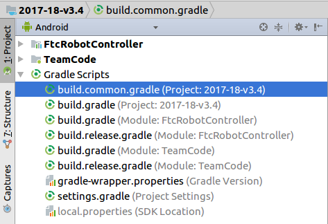

5. Add `jcenter()` to the `repositories` block at the bottom:

    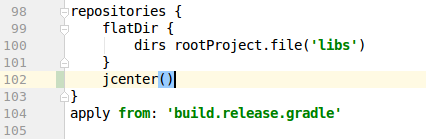

6. Open the `build.gradle` file for the TeamCode module:

    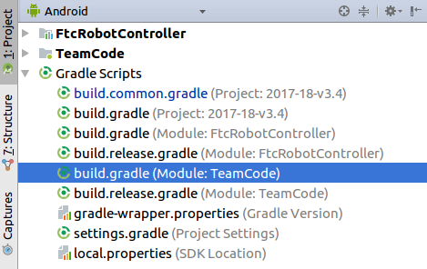

7. At the bottom, add this:

        dependencies {
            //NOTE: this (0.22) is the correct version, the below screenshot is outdated
            compile 'org.openftc:ftc-opmode-tuner-common:0.22'
         }

    When you've done that, the bottom of the file should look like this:

    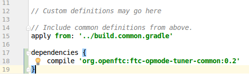

8. Now perform a Gradle Sync:

    

9. Wait for Gradle to finish gradling

10. Congratulations! You are now ready to use the OpModeTuner!

## First Use Instructions:

1. Change your opmode to `extend` either:

    - `TunableOpMode` if you are currently extending `OpMode`
    - `TunableLinearOpMode` if you are currently extending `LinearOpMode`

2. You can consult the JavaDoc for the methods that you can now call. For now though, just go ahead and add this to the main loop of your program:

        telemetry.addData("test", getInt("var1"));
        telemetry.update();

3. Deploy your project to the RC phone

4. Connect the phone with the Tuner app to the Wi-Fi Direct network broadcast by the RC. **READ:** **you *must* connect through the normal Wi-Fi settings screen, NOT through the Wi-Fi Direct screen!** The password for the Wi-Fi network can be found in the About activity of the RC app.

5. If shorty after connecting Android shows a *"WiFi has no internet"* dialog like this:

    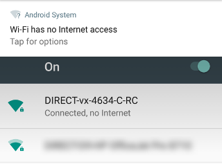

    Then you will need to tap on it, and do this:

    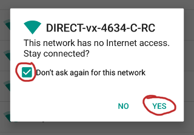

6. Run the OpMode that you just modified, and open the Tuner app on your 3rd phone. If all goes well, this should appear on the RC screen:

    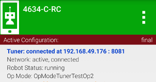

    If it **does** appear, then move on to step 7. If not, then you may need to determine the IP address of the RC phone and input it into the Settings of the Tuner app before it will connect. I'm fairly confident that `192.168.49.1` (the default) is always correct for Wi-Fi Direct group owners, but *shrug* you never know what an OEM might do....

7. In the Tuner app, select *Load Config* from the overflow menu:

    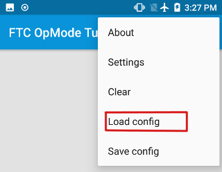

8. Press the *New* button in the top left corner. **READ: this is *NOT* creating a robot hardware configuration, it is something entirely different**

    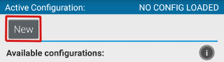

9. You can call the configuration whatever you'd like, and then press OK:

    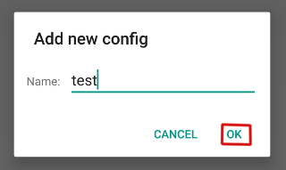

10. Load the configuration that you just created:

    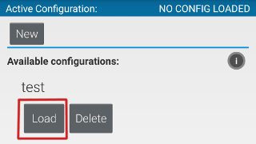

11. Back on the main screen of the Tuner, press the newly visible *Add Field* FAB in the lower right hand corner:

    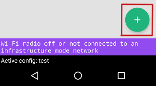

12. Create a new integer *Field* with a tag of *var1*:

    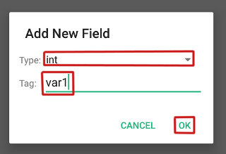

13. Now adjust the value of the *Field* using the slider:

    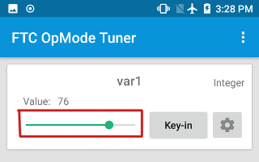

    If all goes well, you should see the number in the Telemetry Area of the DS changing as you move the slider
    
## Setting up this project in AS for develeopment:

If you'd like to contribute to this project, then you will need to setup this repository locally as an Android Studio project. You can do this as follows:

 1. In a directory of your choosing, run:
 
         git clone https://github.com/OpenFTC/FTC-OpMode-Tuner.git
         
 2. On the AS "Welcome" screen, choose *Import project (Gradle, Eclipse ADT, etc.)*
 
 3. Navigate to the directory where you cloned this repository to, and select the root *(FTC-OpMode-Tuner)* folder.
 
 4. Wait for Gradle to finish gradling.
 
 5. You're now all set up!

## Release Notes

### 0.22

Initial alpha release.
